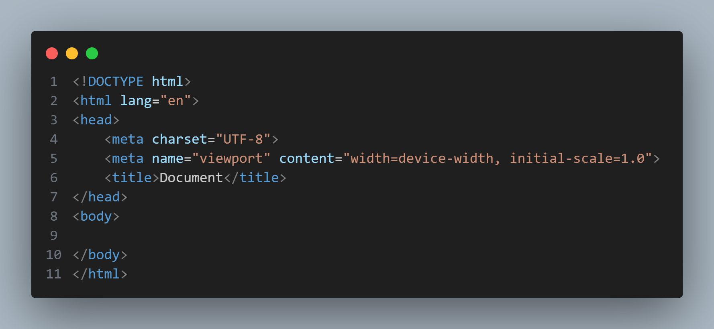
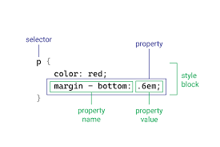
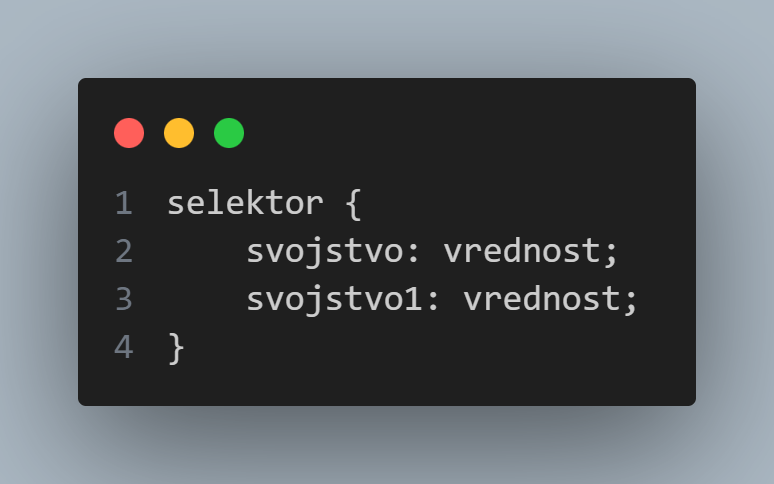

#Uvod u web
Ovo je prateći materijal za kurs **Uvod u web** gde će se nalaziti teorija i dodatna objašnjenja. 


##HTML 
**HTML** (Hypertext Markup Language) dokument se sastoji od niza tagova koji definišu strukturu i sadržaj web stranice. Svaki HTML dokument se sastoji od: 

1. ``` <!DOCTYPE html> ``` - ova linija se nalazi na početku dokumenta i označava da je u pitanju HTML5 standard
2. ``` <html lang="en"> ``` - tag koji označava početak HTML dokumenta, sa atributom za jezik (lang označava jezik dokumenta)
3. ``` <head> ``` - definiše zaglavlje stranice, sadrži metapodatke i informacije o dokumentu. Ove informacije se ne prikazuju direktno na stranici, ali su bitne za pravilno interpretiranje i stilizovanje dokumenata
    3.1 ``` <meta charset="UTF-8"> ``` - postavlja karakter set na UTF-8
    3.2 ``` <meta name="viewport" content="width=device-width, initial-scale=1.0"> ``` - definiše viewport za pravilno prikazivanje na različitim uređajima
    3.3 ``` <title> ``` - definiše naslov stranice koji se prikazuje u tabu browser-a
4 ``` <body> ``` - telo dokumenta, iliti okvir u kome se nalazi stvarni sadržaj stranice koji korisnici vide

####HTML Boilerplate
``` 
<!DOCTYPE html>
<html lang="en">
<head>
    <meta charset="UTF-8">
    <meta name="viewport" content="width=device-width, initial-scale=1.0">
    <title>Document</title>
</head>
<body>
    
</body>
</html> 
```


###HTML Element
**HTML element** je osnovna gradivna jedinica u HTML-u koja se koristi za označavanje i definisanje delova sadržaja na stranici. Element se sastoji od taga i sadržaja, a opciono sadrži i atribut. 

**Tag** je oznaka koja definiše početak ili kraj HTML elementa. Primeri tagova su:``` <p></p>  ```
U osnovnoj podeli razlikujemo dva tipa tagova, **parni tag** (paired ili closing tag) i **samostalni / samozatvrarajući tag** (self-closing). 

**Parni tagovi** se koriste za definisanje početka i kraja određenog elementa, obuhvatajući sadržaj. Primer: ``` <p></p> <h1></h1> <div></div>``` 
**Samostalni tag** nemaju zatvarajući tag i koriste se za dodavanje određenog efekta ili elementa koji nema dodatni sadržaj. Primer: ```  <br> <hr>``` 

**Atributi** su dodatne informacije koje se mogu dodati HTML elementima kako bi se pružile dodatne informacije ili kontrolisalo ponašanje elementa. Atributi se dodaju unutar otvarajućeg taga. Primer: 
``` <p id="jedinstveniIdentifikator" class="klasa">Sadržaj</p> ```
``` <a href="putanja-do-druge-stranice">Link</a> ```
```  ```

*U navedenim primerima, ovo su atributi: id, class, href, src, alt

Tagove još možemo podeliti na **kontejnerske (strukturalne)** i **semantičke tagove**. 
**Kontejnerski tagovi** prvenstveno ne nose informacije o sadržaju već organizuju i struktuišu dokument. Služe kao blokovi koji grupišu i organizuju druge elemente. I semantički tagovi mogu da se posmatraju kao kontejnerski, ali u ovom slučaju prvenstveno se misli na tagove kao što su ``` <div> ```i ``` <span> ```. 
**Semantički tagovi** nose informacije o značenju i sadržaju koji obuhvataju. Oni pružaju dodatne informacije o strukturi dokumenta i pomažu pregledačima, pretraživačima i drugim alatima da bolje razumeju sadržaj web stranice. Primer: ``` <header> ```, ``` <nav> ```, ``` <main> ```, ``` <section> ```,... 

##CSS
**CSS** (Cascading Style Sheets) je jezik za stilizovanje dokumenata na webu. Stilovi u CSS-u se primenjuju po principu **kaskadnog** (cascading) modela što znači da stilovi mogu kaskadno prelaziti sa jednog elementa na drugi i redosled definisanja stilova može uticati na krajnji rezultat, kao i pravilo prioriteta (specificity). 

####Primena CSS-a
Pod primenom se misli na 'povezivanje' CSS-a sa HTML-om. Postoje 3 metode: 
1. **Inline** - stilovi se pišu direktno unutar HTML elementa pomoću 'style' atributa: ``` <p style="color:black">...</p> ```
1. **Internal** - stilovi se pišu unutar ``` <style> ``` elementa koji se nalazi ili unutar ``` <head> ``` ili ``` <body>```, jedino je bitno da se stilovi definišu pre HTML elemenata na koje želimo da se primene. 
1. **External** - stilovi se definišu u odvojenom CSS fajlu koji se povezuje sa HTML-om. Ova metoda omogućava ponovnu upotrebu i održivost, posebno kada se isti stilovi primenjuju na više stranica. 
Za povezivanje eksternog CSS fajla sa HTML-om koristimo ``` <link> ``` tag koji se inače koristi za povezivanje spoljašnjih resursa. 
``` <link rel="stylesheet" href="styles.css"> ```
*Najčešće i preporučeno je da se povezivanje uradi u ``` <head> ``` sekciji, ali je moguće i u okviru ``` <body> ```

###Anatomija CSS-a
Anatomija CSS-a obuhvata osnovne strukture, pravila i koncepte koji čine stilski jezik. 

1. **Pravilo (Rule)** definiše stilove koji se primenjuju na određeni set elemenata. Svako pravilo sastoji se od selektora, bloka deklaracija i unutar bloka deklaracija se nalaze pojedinačne deklaracije koje određuju stilizovane karakteristike. 


1. **Selektor** identifikuje koji HTML elementi će biti stilizovani pravilima koji slede (element, #id, .klasa, * ...)


***NASTAVIĆE SE***


####CSS Position

**static** (podrazumevana vrednost): Elementi se pozicioniraju prema normalnom toku dokumenta.

**relative**: Element zadržava svoj normalni prostor, ali se može pomeriti relativno u odnosu na svoju normalnu poziciju pomoću top, right, bottom i left svojstava.

**absolute**: Element se pozicionira u odnosu na prvog roditeljskog elementa koji ima postavljenu vrednost relative, ili u odnosu na sam dokument ako takav roditelj ne postoji. Ne zauzima mesto u normalnom toku dokumenta.

**fixed**: Element ostaje fiksiran u odnosu na pregledač prozora. Ne zauzima mesto u normalnom toku dokumenta.

**sticky**: Element se ponaša kao relative do tačke, nakon čega postaje fixed u odnosu na roditeljski kontejner.

U CSS-u, svojstva **left**, **right**, **top**, i **bottom** koriste se u kombinaciji s position svojstvom kako bi odredili poziciju elementa. 

**z-index** svojstvo se koristi za takozvanu treću dimenziju, odnosno za kontrolu redosleda slojeva kod pozicioniranih elemenata


